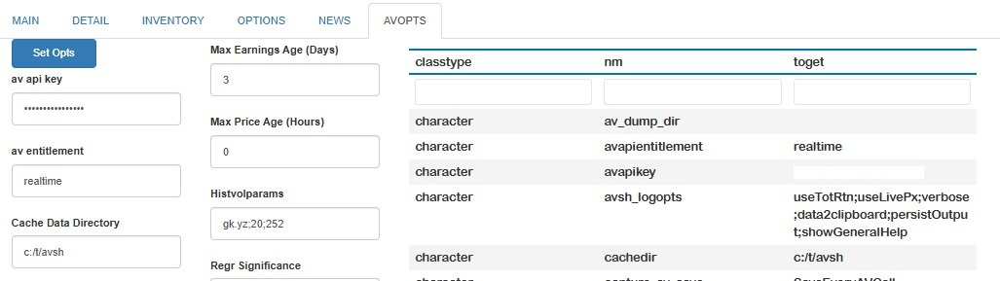

<!-- README.md is generated from README.Rmd. Please edit that file -->

# [alphavantagepf](https://derekholmes0.github.io/alphavantagepf/index.html)

<!-- badges: start -->

<!-- badges: end -->

A comprehensive R and Shiny interface for using, visualizing, and
analyzing financial data based on the [Alpha Vantage
API](https://www.alphavantage.co/). A functional interface and several
associated helper functions extracts data directly from API calls, and
can be used as a stand-alone source to build a finance data stores.
Those calls are integrated into a Shiny (and functional) interface which
seamlessly downloads and manages data across multiple asset classes,
including Equities, FX, indices, options or any other user-specified
data. The Shiny app is modeled after modern professional tools with a
simple one-line interface to display, visualize and analyze downloaded
data. Both user data and user analytics can be added easily.

## Installation and First Steps

You can install the development version of alphavantagepf from Github,
or the production version from CRAN using either of the following. I’m
continually improving the shiny app, so if you are a frequent user, you
may want to install the development version.

    #pak::pak("derekholmes0/alphavantagepf")
    install.packages("alphavantagepf")

<span style="color:red">

Load the package.

``` r
library(alphavantagepf)
```

Set your API key obtained from [Alpha
Vantage](https://www.alphavantage.co/). If you have paid access, include
an additional argument with your entitlement status, which is one of two
strings “delayed” or “realtime”. “delayed” may be needed for some
historical quotes.

``` r
avpf_api_key("YOUR_API_KEY","delayed")
print(avpf_api_key())
#> [1] "YOUR_API_KEY" "delayed"
```

If you want to use the Shiny interface, you can launch it using the
command `av_runShiny()`, which will fill in the API keys if they have
been set, or direct you to set them if not.

## Functional Interface Example

Once the API key has been set, use the function `av_get_pf()` which
requires at minimum two arguments, a `symbol` (put first to facilitate
usage in pipes) and an Alphavantage “function” `av_fun`.\
The `symbol` parameter is required, but can be a simple empty string for
functions that don’t require a symbol, e.g. `TOP_GAINERS_LOSERS`, or a
list of symbols for bulk data, e.g. `REALTIME_BULK_QUOTES`. Data is
turned as a `data.table()`, with a `symbol` column if relevant. (Data
can be cast into other forms, e.g. `tibble`s or `xts` from there.)

Parameters for each call follow exactly the conventions as on the API
web`av_funhelp()`.

``` r
av_funhelp("TIME_SERIES_INTRADAY")
av_get_pf("IBM","TIME_SERIES_INTRADAY") |> head()

   symbol           timestamp  open  high   low close volume
   <char>              <POSc> <num> <num> <num> <num>  <int>
1:    IBM 2026-01-02 11:00:00   292   293   291   292 141979
2:    IBM 2026-01-02 11:15:00   293   293   292   292 117760
```

Additional parameters can be passed both to the API itself
(e.g. parameters for technical indicators, or download windows) and to
the `av_get_pf()` function (e.g. verbosity, delays in calls, etc.) See
vignette for details.

### Extracting data from API calls.

Calls to the API frequently return complex data structures, such as
embedded data.frames (for earnings, lists, etc.). Data may be in a
format that may not be as useful (e.g. FX) or quite large
(e.g. Options). Several helper functions are available to get to the
actual data desired. A partial list is

| Function | Description |
|:--:|:---|
| [av_extract_df()](https://derekholmes0.github.io/alphavantagepf/reference/av_extract_df.html) | Extract an embedded `data.table()` |
| [av_extract_fx()](https://derekholmes0.github.io/alphavantagepf/reference/av_extract_df.html) | Extract FX quotes |
| [av_extract_av_extract_divs_or_splits()](https://derekholmes0.github.io/alphavantagepf/reference/av_extract_df.html) | Extract Dividends or Splits |
| [av_grep_opts()](https://derekholmes0.github.io/alphavantagepf/reference/av_grep_opts.html) | Filter an option list |

For example, market movers can be extracted in the following way:

``` r
av_get_pf("","TOP_GAINERS_LOSERS") |> av_extract_df("top_losers")

    <char>   <num>         <num>            <char>     <num>             <char>
 1:    OCG  0.0378       -0.0654         -63.3721% 216078762 TOP_GAINERS_LOSERS
 2:   ZBIO 16.6100      -17.8900         -51.8551%   8034469 TOP_GAINERS_LOSERS
```

or Currencies quotes using

``` r
av_get_pf("USD/BRL","CURRENCY_EXCHANGE_RATE") |> av_extract_fx()

Key: <symbol>
    symbol   Ask   Bid      QuoteTimestamp   Mid
    <char> <num> <num>              <POSc> <num>
1: USD/BRL  5.37  5.37 2026-01-06 15:47:46  5.37
```

More examples and notes are in the accompanying vignette.

# A powerful interactive interface

An interactive Shiny interface is included in the package to manage,
analyze and visualize data. Some key features of the interface are:

- **The app abstracts out the asset-specific bias of the Alphavantage
  data.** You can analyze a stock, a crypto, and an FX pair all in one
  line. All price data is collected, cached, and maintained in one data
  set, which can easily be accessed outside of the app.
- **The app utlizes a single command line to do everything.** For
  example, to plot total returns for four asset classes, just type
  `NDX;IBM;BTC/USD;USD/BRL GPI`. If the data isn’t there, the app gets
  it from [Alpha Vantage API](https://www.alphavantage.co/) and saves
  it. If realtime quotes are necessary (and you have the right
  permissionings), the app gets them automatically. See vignette
  (<span style="background-color: #003366; color: #FFFFFF;">LINK_usage</span>)
  for further details.
- **Typing and mousing are minimized.** by using a command lines sets of
  assets which can be saved and recalled at any time, or added as a
  `data.frame()` externally.
- **The app is expandable.** User time series data can be added using
  one function, which is then accessible just like any other data. Users
  can code and add their own analytics, as long as the function returns
  a list of tables ([gt](https://gt.rstudio.com/reference/index.html)
  objects), [dygraphs](https://rstudio.github.io/dygraphs/), or
  [ggplots](https://ggplot2.tidyverse.org/reference/index.html). The
  vignette
  <span style="background-color: #003366; color: #FFFFFF;">LINK_extensions</span>
  provides details.

To launch the app, run
[av_runShiny()](https://derekholmes0.github.io/alphavantagepf/reference/av_runShiny.html),
and start with the first step of setting your API key. (See
[Vignette](https://derekholmes0.github.io/alphavantagepf/articles/ShinyApp_setup_and_usage.html)
for other items you can set) Once the API key is set, it’s easy to start
building a data set and analyzing it in real time.

## Initial setup

The first time
[av_runShiny()](https://derekholmes0.github.io/alphavantagepf/reference/av_runShiny.html)
is run, a temporary data directory is created and a setup/options tab is
displayed. At a minimum, fill in your API key and permissionings status
(unless already saved with `avpf_api_key()`). Unless you want to keep
the data in a default caching directory, I would also recommend creating
a location for data to be saved. Hit
<span style="background-color: #003366; color: #FFFFFF;">Set Opts</span>
and a table showing those selections (along with all other saved
internal data) will be shown. A full description of the options
available is given in the setup vignette
<span style="background-color: #003366; color: #FFFFFF;">LINK_setup</span>.

<figure>

<figcaption aria-hidden="true">Initial Setup</figcaption>
</figure>

## Finding and running commands

Not much can be done without a little data, so the first step is to
start with a list of commands and doing a few analyses (e.g. graphs) for
a set of assets.

While a few options are set outside the “command line”, all analyses are
typed into the top (yellowed) line. Commands have one of two forms:

- **Single name commands** do not need any particular set of assets, and
  all start with the prefix `AV.`. The first command you should run is
  `AV.H` to show what commands are available. (Note that more
  explanatory notes are given unless the `showGeneralHelp` option is
  deselected in the
  <span style="border: 1px solid #000000; padding: 2px 6px;">AVOPTS</span>
  tab.)

<figure>

<figcaption aria-hidden="true">Set opts</figcaption>
</figure>

- **Commands on asset groups** are applied to a semi-colon delimited set
  of assets, and is of the form

> Symbol_11;Symbol_2;…;Symbol_n Command Options

If an asset or commmand is invalid, the app will tell you, otherwise it
will download what it needs using
[av_get_pf()](https://derekholmes0.github.io/alphavantagepf/reference/av_get_pf.html),
save the data and and run the analysis. For example, to get a simple
total return graph of a set of ETFs, just enter `QQQ;SPY;DIA;EEM GPI` in
the yellow line, and get a dygraph (created with
[fgts_dygraph()](https://derekholmes0.github.io/FinanceGraphs/reference/fgts_dygraph.html)):

<figure>

<figcaption aria-hidden="true">ETF Example</figcaption>
</figure>

A brief outline of what can be done is shown in the table below. Note
that

- Some commands compare the assets in the main line with a
  *counterasset* specified in a different box.\
- Commands that end in `2` put their graphs (etc) below any main graph.
  This allows two independent time series to be visualized.
- Neither commands nor symbols are case sensitive.

| Category | Example(s) | Functionality |
|:--:|:--:|:---|
| Time Series | `QQQ GPI`,`SPY GPI2` | Asset prices or rebased indices, possibly in the middle of the time series |
|  | `QQQ GV` | Rolling volatilities |
| Scatter | `QQQ SCATI` | Scatter plot of assets against counterasset |
| Relative Value | `QQQ RV` | Active return indices and statistics against counterasset |
| Financials | `IBM EA` | Dividends, earnings/transcripts, Descriptions |
| Historical Financials | `IBM GEP` | Time series of (e.g.) Earnings Yield |
| News | `IBM;MU CN` | Table of news stories, with links |
| Ticker Search | `mining S` | Search on symbol or name |
| Options | `QQQ OS` | Table of options, implied Vols, etc |
| Miscellaneous | `av.mov`,`av.inv` | Market movers, data inventory, help |

This app seeks to facilitate quick ad-hoc analyses by minimizing typing
and providing command persistence.

- **Asset Lists** are groups of assets saved or recalled by name. To do
  so, type in your list name in the box to the right of the yellow asset
  line, and click
  <span style="background-color: #003366; color: #FFFFFF;">save</span>.
  To recall the items in a list, select the name from the dropdown and
  click
  <span style="background-color: #003366; color: #FFFFFF;">get</span>.
  The assets in that list will then be pasted into the command line
  (keeping the currently chosen command)

- **Command persistence** is availble using the `AV.HIST` commands and
  `AV.R <n>` commands, which list the last several commands used and
  recalls them by number.

## Data management and adding new commands

Price, dividend and earnings data are all stored internally in
`data.table()` format[^1], with columns coming directly from relevant
the relevant `av_get_pf()` calls. One of the key contributions of this
package is to standardize different [Alpha Vantage
API](https://www.alphavantage.co/) output forms into one common format.
That effort requires knowing what asset class each ticker belongs to,
since there are differnt API calls for each. Asset classes are
determined by comparing them with pre-downloaded[^2] symbol lists, or
asssumed to be currencies if they are of the standard
`[[:alpha:]]*3/[[:alpha:]]*3` format.

### Adding data

Those files can be read (*and written to*) outside the shiny app, so the
data can be used for other analyses (e.g. RMarkdown runs) or added to
externally as user data or indices. Time series data (kept in a file
called `avpf_px.fst`) can be added using the
[av_add_px()](https://derekholmes0.github.io/alphavantagepf/reference/av_add_px.html)
function. Historical earnings (kept in `avpf_earn.fst`) or forecasts
(kept in `avpf_earnest.fst`) are managed separately using
[av_add_earn()](https://derekholmes0.github.io/alphavantagepf/reference/av_add_earn.html).
See
<span style="background-color: #003366; color: #FFFFFF;">LINK_data</span>
for details.

As an example, suppose we wish to plot two fixed income ETFs against Fed
Funds. We can use e.g. `quantmod` to download and add the data. All we
need to do is ensure that we have the symbol, a `Date`-classed field and
a `close` field.

``` r
suppressMessages(require(quantmod))
ffdta <- as.data.table(quantmod::getSymbols("FEDFUNDS",src="FRED",auto.assign=FALSE))
ffdta <- ffdta[,.(DT_ENTRY=index,close=FEDFUNDS,symbol="FEDFUNDS")]
av_add_px(ffdta)
```

\*\* PICTURE \*\*

Historical earnings and estimates can be added or downloaded using
[av_add_earn()](https://derekholmes0.github.io/alphavantagepf/reference/av_add_earn.html),
If the data itself is not given, then a simple `data.frame()` of
equities can be given to download the relevant data. Asset lists can
also be added using
[av_add_assetgroups()](https://derekholmes0.github.io/alphavantagepf/reference/av_add_assetgroups.html)

### Getting data

In addition to reading the price files directly, data can be captured
for use in other apps or ad-hoc analyses in in two ways: \* **Copy to
cliboard:** Any data that goes into a graph or table is automatically
copied to the clipboard if the **data2clipboard** option is set. \*
**Function call capture:** Each individual call to `av_get_pf()` can be
cached to the `AV dump Directory` which *optionally* can be set also in
<span style="border: 1px solid #000000; padding: 2px 6px;">AVOPTS</span>.
Data is saved in a named (by Alphavantage function) list of data.tables,
and can be keyed (and upserted) or appended to a saved `.Rd` file. See
<span style="background-color: #003366; color: #FFFFFF;">LINK_setup</span>
for details.

## Adding new Functionality

New commands can be added by writing yur own functions and “registering”
them with the app. New functions have two arguments: (1) a string with
the command and any subsequent options, and (2) A list of all current
(de-reactive’d) values of the input fields. They must return a (possibly
named) list of `gt()` tables, `dygraphs()`, or `ggplots()` to be
displayed when the command is run. See
<span style="background-color: #003366; color: #FFFFFF;">LINK_newfunc</span>
for details.

To do:

1.  Make sure commands are instantaly recognizable on addition
2.  LLMs?

[^1]: Larger data sets (e.g. price data) is stored in a
    [fst](https://www.fstpackage.org/) file. Smaller data is kept in
    standard `.Rd` files. A database interface is planned at some point.

[^2]: Lists of equities, ETFs and available indices (see `av.tickers`)
    are downloaded each time the `av_runShiny()` is run.
    Cryptocurrencies tickers are hard-coded into the package.
