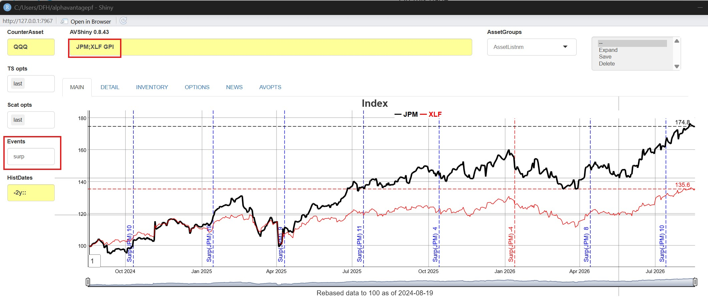

# ShinyApp Graphs and Options

This vignette describes in detail graphing and data options available in
[av_runShiny()](https://derekholmes0.github.io/alphavantagepf/reference/av_runShiny.html).
Graphing options are typically set within the boxes to the side of the
main screen, while all other options are set in the AVOPTS tab.

## Application Options

Application defaults are initialized upon setup, and are saved
persistently in a file ()`avpf_constants.RD`) within a cache directory
chosen by `tools::R_user_dir("alphavantagepf", which = "cache")`. Data
itself is stored in the same directory unless a **Cache data directory**
is set up. The options can be categorized within three groups: required
API options, data management options, and others.

Options

[TABLE]

### Required API Options

This app is centered around the Alphavantage API, and requires a valid
API key and entitlement status to function.

|     Field      | Description                                        |
|:--------------:|:---------------------------------------------------|
|   av api key   | API key obtained form Alphavantage.                |
| av entitlement | Entitlement status, either `delayed` or `realtime` |

### Data Management Options

Data is stored in one or two directories, depending on whether a **Dump
directory** is set.

- Price series and user time series are kept in a **cache directory**
  which defaults to the temporary directory created for the package, but
  can be set as above to a more user friendly location (e.g. `c:/t/avsh`
  as above). Earnings data is stored in the same directory.

- **Update Frequencies** are set in set in the (B) Update frequencies
  section above, and are the maximum time between downloads of data. For
  prices, only the smallest historical data is retrieved and updated
  into the local dataset if they are older than the time specified[^1].
  Historical earnings estimates are fuller redownloaded if they are
  older than the number of days specified.

- The results of each call to the Alphavantage API can optionally be
  stored in a **Dump directory**. The purpose of this is to allow users
  to “scrape” their thoughts, analyses, etc. on a per-call basis. Please
  be aware that this does increase the time spent on each command
  issued. That directory is set in Dump Directory (in the  
  (C) Dump data: section above) where data is stored as a named (by
  function call name) list of `data.tables()`.

The options associated with the dumping are given below:

[TABLE]

More detail on this feature is in the [Data
Vignette](https://derekholmes0.github.io/alphavantagepf/articles/ShinyApp_3_Data_Management.html)

### Non-analytic Options

Non analytic features are set as check boxes in options section D, and
are described in the following table. Note that any changes made only
take effect when the Set Opts button is pressed.

[TABLE]

### Analytics Options

These are default statistical parameters:

| Field | Description |
|:--:|:---|
| HistVolParams | Historical volatility parameters, see [TTR::volatility](https://www.rdocumentation.org/packages/TTR/versions/0.24.4/topics/volatility) |
| Regr Significance | Significance level below which regression results are highlighted |

## Graphing Options

The default graphing package used is
[FinanceGraphs](https://derekholmes0.github.io/FinanceGraphs/) which
provides finance-specific graphing functions based on
[dygraphs](https://rstudio.github.io/dygraphs/) and
[ggplot2](https://ggplot2.tidyverse.org/reference/index.html). Any of
the features described there can be used, most notably:

- **Event Sets** which can be used to highlight events or regimes in a
  time series.
- **Automated rescaling** of data to put in total return (index) terms.
- **Annotations** to highlight levels on a graph, e.g. last values.
- **Full aesthetic control** of the graphing output, including colors,
  line types, and point types. For example, to change color sets for
  timeseries lines, use an aesthtic set (e.g. `lines` or `altlines_6`).
  See [Color
  customization](https://derekholmes0.github.io/FinanceGraphs/articles/Time-Series-dygraph.html#customization-colors)

Specific options for this app are described below, referencing this
example:

GraphOptions

- **Historical timeframes** are given by date strings in ther
  `HistDates` box. For example, time series for the past 4 years from
  [`Sys.Date()`](https://rdrr.io/r/base/Sys.time.html) are specified as
  `"-4y::"`. Note this is the *parameter is used for all historical
  analyses and requests*, not just graphs. For example, `IBM EA` would
  only report 4 years of data given the configuration described here.

- **Time Series Opts** are options that can be used to decorate or
  modify a time series graph. Choices are

|    TS Choice     | Description                                  |
|:----------------:|:---------------------------------------------|
|      `last`      | Add last value for each series at last point |
|    `splitts`     | Split first series into separate axis        |
|   `lastlabel`    | Add label for series at last point           |
| `highlightfirst` | Make first series bolder                     |
|     `hilow`      | Add high-low ranges if available             |

- **Scatter Options** apply to scatterplots, and are:

| Scatter Choice | Description |
|:--:|:---|
| `last` | Show last value as large point |
| `tailhedge` | Split return scatter plot regressions into three piecewise regressions, one each for big negative returns, big positive returns, and everything else |

- **Events** are dates or date ranges highlighted in the graph. Any
  valid event string can be used. For example, `tp,5` finds 5 turning
  points for the first series plotted, as seen in the picture above.

### Enhancements for this app.

A few enhancements have been added to the
[av_runShiny()](https://derekholmes0.github.io/alphavantagepf/reference/av_runShiny.html)
set of options.

- **Tail Hedge regressions** (see above) separate out large moves from
  smaller moves in asset regressions.
- **Extra events**. Im addition to any events defined or created from
  the [FinanceGraphs](https://derekholmes0.github.io/FinanceGraphs/)
  package, you can also add to timeseries:

|  Event   | Description                                                  |
|:--------:|:-------------------------------------------------------------|
|  `earn`  | Show EPS at report dates                                     |
|  `surp`  | Show earnings suprises at report dates, color coded by sign. |
|  `div`   | Show dividends at ex-dates                                   |
| `divpct` | Show dividends as percent of close at ex-dates               |

As an example of how to use those events, here is a graph of JPM and
XLF, with earnings surprise events:

earn_on_gpi.jpg

[^1]: Live data is always retrieved if the option to do so is set in the
    options section D
