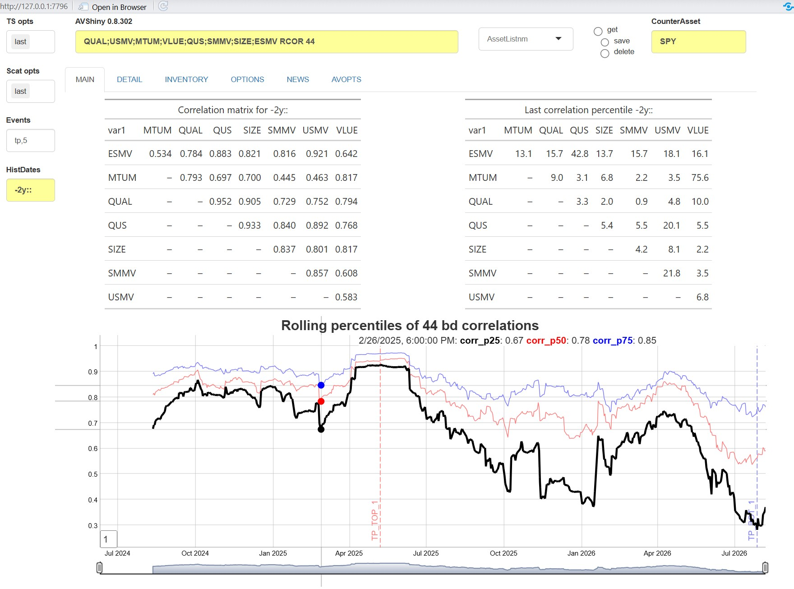

# ShinyApp_4_New_Functionality

## Introduction: Innovate or die

The commands embedded with this app are just basic building blocks and
nowhere near sufficient to do all the analyses that may be required. The
app is designed to be extended by allowing users to add new functions
outside the**Alphavantagepf** package.

New functions will take (as inputs) the command (and options) to be
executed and a named list with the current values of every design
element in the app, augmented with a few more parameters to simplify
function definitions. The function can call upon a number of “interface”
functions to both get data from the app’s internal store, and to
interface with the feedback elements of the app. As output, the function
should return a (possibly named) list of tables
([gt](https://gt.rstudio.com/reference/index.html) objects),
[dygraphs](https://rstudio.github.io/dygraphs/), or
[ggplots](https://ggplot2.tidyverse.org/reference/index.html). The
element names can correspond to the output names defined in the next
section, or (if the list is unnamed) will be filled in order.

The examples in this section assume some familiarity with
[`data.table()`](https://rdrr.io/pkg/data.table/man/data.table.html). At
some point, I’ll rewrite them in simpler formats.

### App layout: Outputs

Outputs in the main page are shown in the following order:

| TAB | Name | Order Shown | Class | Type |
|:--:|:--:|:--:|:--:|:--:|
| MAIN | MSG | 1 | character | text |
| MAIN | GT1 | 2 | gt_tbl | [gt](https://gt.rstudio.com/reference/index.html) |
| MAIN | GT2 | 3 | gt_tbl | [gt](https://gt.rstudio.com/reference/index.html) |
| MAIN | GT3L | 4 (L) | gt_tbl | [gt](https://gt.rstudio.com/reference/index.html) |
| MAIN | GT3R | 5 (R) | gt_tbl | [gt](https://gt.rstudio.com/reference/index.html) |
| MAIN | TS1 | 6 | dygraphs | [dygraphs](https://rstudio.github.io/dygraphs/) |
| MAIN | TS2 | 7 | dygraphs | [dygraphs](https://rstudio.github.io/dygraphs/) |
| MAIN | SCAT1 | 8 | ggplot2::ggplot | [ggplots](https://ggplot2.tidyverse.org/reference/index.html) |
| MAIN | SCAT2 | 9 | ggplot2::ggplot | [ggplots](https://ggplot2.tidyverse.org/reference/index.html) |
| DETAILS | DGT1 | 1 | gt_tbl | [gt](https://gt.rstudio.com/reference/index.html) |
| DETAILS | DGT2 | 2 | gt_tbl | [gt](https://gt.rstudio.com/reference/index.html) |
| DETAILS | DSCAT1 | 3 | ggplot2::ggplot | [ggplots](https://ggplot2.tidyverse.org/reference/index.html) |
| DETAILS | DSCAT2 | 4 | ggplot2::ggplot | [ggplots](https://ggplot2.tidyverse.org/reference/index.html) |

So for example, a named list of the form

will show `mtcars` as a table followed by a scatterplot on the MAIN tab,
and a truncated table first in the DETAILS tab.

### App layout: inputs

The values of input design elements are all passed into a user function
as (de-reacted) named list. The app command `AV.INPUTS` will produce a
full table of the current values of design elements. The most important
items for a user function are listed below:

|    inputId     |   Type    |         Description          |      Example      |
|:--------------:|:---------:|:----------------------------:|:-----------------:|
|  `assetline`   | character |         Asset string         |      QQQ;DIA      |
|     `todo`     | character |     Full Command to Run      | QQQ;DIA GPD -6m:: |
|   `todofunc`   | character |         Command base         |        GPD        |
|   `todoargs`   | character |      Command arguments       |       -6m::       |
|    `istr1`     | character |       Full input line        | QQQ;DIA GPD -6m:: |
|   `inTabset`   | character |    Currently selected Tab    |       MAIN        |
|    `istr2`     | character |         Counterasset         |        SPY        |
|  `dtstr_hist`  | character |     Analysis date string     |       -2y::       |
|   `cachedir`   | character |  Directory with cached data  |     c:/t/avsh     |
| `ts_volparams` | character |    Volatility parameters     |   gk.yz;20;252    |
|    `sigpct`    | character |      Highlight p-value       |       0.025       |
|    `gropts`    | character | Time Series Graphing options |       last        |
|   `scatopts`   | character |     Scatter plot options     |       last        |
|  `ts_events`   | character |      Time Series Events      |       tp,5        |

All other items in the named list can be found either by inspection when
the function is run within the shiny app, or by inspecting the source
code of the `ui` function generator in the file `app.R`.

## Writing and registering new functions and commands

New functions that provide analytics must have the following properties:

- Take two arguments: `todo` with the command, and `rv` (For Reactive
  values)
- Return a list of `gt()` tables, `dygraphs` or `ggplots`.
- Be accessable from `.GlobalEnv`
- Be registered with the
  [av_add_analytic()](https://derekholmes0.github.io/alphavantagepf/reference/av_add_analytic.html)
  function, which requires
  - A `runcode` which is the command that will be typed (e.g. `COR` for
    correlation analysis)
  - The `func_name` of the function to run
  - An optional help string to be shown when `AV.H` is run
  - The `focus` tab to be shown upon completion of the function.

Functions can also access the data contained in the app and interact
with the user using a few helper functions. The data can also be
accessed directly if you’re familiar with its format and location.

### Helper Functions: Data

The most important thing a user needs is access to the data held by the
app. A list of the internal tables which can be accessed via the
[av_load_shinydata()](https://derekholmes0.github.io/alphavantagepf/reference/av_load_shinydata.html)
function (and listed by running from the console `dump_state("data")`)
is

| Name | Description |
|:--:|:---|
| assetgroups | Table of asset groups |
| avsh_funcs | Current list of functions |
| cmdhist | Rolling history of commands issued |
| earn | Earnings Data |
| earnest | Earnings Forecasts |
| listings | Equity Listings obtained from `av_get_pf("","LISTING_STATUS")` |
| pxd | Price Time Series Data |
| pxinv | Data inventory |
| renderset | Table of output elements |
| tickerlist | List of indices and crypto pairs availble form AlphaVantage |

For example, to get price data for a ticker string, use

    > tickers_to_get=strsplit("IBM;QQQ;SPY",";")[[1]]
    > pxdata <- av_load_shinydata("pxd")[data.table(symbol=tickers_to_get),on=.(symbol)]
    > pxdata
     symbol  timestamp  open  high   low close adjusted_close   volume dividend_amount split_coefficient                  ts origclose
     <char>     <IDat> <num> <num> <num> <num>          <num>    <num>           <num>             <num>              <POSc>     <num>
        IBM 1999-11-01  98.5  98.8  96.4  96.8           47.1  9551800               0                 1 2026-08-03 15:10:30        NA
        IBM 1999-11-02  96.8  96.8  93.7  94.8           46.2 11105400               0                 1 2026-08-03 15:10:30        NA
        IBM 1999-11-03  95.9  95.9  93.5  94.4           46.0 10369100               0                 1 2026-08-03 15:10:30        NA
        IBM 1999-11-04  94.4  94.4  90.0  91.6           44.6 16697600               0                 1 2026-08-03 15:10:30        NA
        IBM 1999-11-05  92.8  92.9  90.2  90.2           44.0 13737600               0                 1 2026-08-03 15:10:30        NA
        ---        ---   ---   ---   ---   ---            ---      ---             ---               ---                 ---       ---
        SPY 2026-07-27 744.9 745.5 735.9 739.1          739.1 41461194               0                 1 2026-08-01 19:38:06        NA
        SPY 2026-07-28 739.2 742.8 736.0 740.9          740.9 47322247               0                 1 2026-08-01 19:38:06        NA
        SPY 2026-07-29 740.0 742.7 729.1 729.5          729.5 70697215               0                 1 2026-08-01 19:38:06        NA
        SPY 2026-07-30 736.0 742.5 734.6 741.7          741.7 66811268               0                 1 2026-08-01 19:38:06        NA
        SPY 2026-07-31 744.7 748.9 737.7 747.0          747.0 62445899               0                 1 2026-08-01 19:38:06        NA

Outside of the function, use
[av_load_shinydata()](https://derekholmes0.github.io/alphavantagepf/reference/av_load_shinydata.html)
without arguments to load the data into the app without actually running
it.

The sister package
[FinanceGraphs](https://derekholmes0.github.io/FinanceGraphs/) also
contains some very helpful functions consistent with the design
conventions of this app:

| Function | Description |
|:--:|:---|
| [narrowbydtstr()](https://derekholmes0.github.io/FinanceGraphs/reference/gendtstr.html) | Filter a [`data.table()`](https://rdrr.io/pkg/data.table/man/data.table.html) using a date string |
| [extenddtstr()](https://derekholmes0.github.io/FinanceGraphs/reference/gendtstr.html) | Expand a datestring into a new one |
| [gendtstr()](https://derekholmes0.github.io/FinanceGraphs/reference/gendtstr.html) | Expand a datestring into a list of dates |

### Helper Functions: UI Interaction

Three other functions may be used to interact with the user via the
Shiny app:

| Function | Critical Arguments | Description |
|:--:|:---|:---|
| [avsh_quick_message](https://derekholmes0.github.io/alphavantagepf/reference/av_runShiny_interface.html) | `where,this_message=""` | Give user feedback below a design element |
| [avsh_clipboard](https://derekholmes0.github.io/alphavantagepf/reference/av_runShiny_interface.html) | `data table` | Copy data to the clipboard |
| [avsh_set_tabtitle](https://derekholmes0.github.io/alphavantagepf/reference/av_runShiny_interface.html) | `newtext="",tabnm="detail"` | Set a Tab title and optionally change focus to it |

### Registering a new function

The minimal information necessary to integrate your function into the
app is shown below:

|    Name     | Required | Description                                |
|:-----------:|:--------:|:-------------------------------------------|
|  `runcode`  |    Y     | What user need to type to run the function |
| `func_name` |    Y     | Name of function                           |
|  `helpstr`  |    N     | Help String to add to `AV.H`               |
|   `focus`   |    N     | Tab to switch focus to                     |

and is added to the app’s internal cache using
[av_add_analytic()](https://derekholmes0.github.io/alphavantagepf/reference/av_add_analytic.html)

## Example: Rolling Correlations

Suppose we wish to add an analytic which (given a set of assets) does
the following with the assets entered with the command.

- Produces a time series graph (`dygraph()`) with the an average rolling
  correlation, as well as 25th and 75th percentiles
- Produces a table (`gt()`) with a correlation matrix of returns over
  the entire history.
- Produces a table (`gt()`) with a matrix of percentiles of the last
  rolling correlation over the entire history[^1].

### Writing a function

Putting the above information together we can create the following
function

``` r

my_corr <- function(todo,rv) {
    # Get Data
    tickers_to_get=strsplit(rv$assetline,";")[[1]]
    roll_window <- fcoalesce(as.numeric(rv$todoargs),22) # default to 22 day rolling correlation
    if(length(tickers_to_get)<3) { 
        avsh_quick_message("Need at least 3 tickers")
        return() }
    
    allpx <- av_load_shinydata("pxd")[data.table(symbol=tickers_to_get),on=.(symbol)]
    allpx <- allpx[,rtn:=c(NA_real_,diff(log(adjusted_close),1)), by=.(symbol)]
    newdtstr <- FinanceGraphs::extenddtstr(rv$dtstr_hist,begchg=-ceiling(31/22*roll_window))
    allpx <- allpx [,.(symbol,timestamp,rtn)] |> FinanceGraphs::narrowbydtstr(newdtstr)

    # get Data
    pairs <- CJ(var1=tickers_to_get,var2=tickers_to_get)[var1<var2,]
    corDT1<- allpx[,.(timestamp, var1=symbol, rtn1=rtn)][pairs,on=.(var1),allow.cartesian=TRUE]
    corDT<- allpx[,.(timestamp, var2=symbol, rtn2=rtn)][corDT1,on=.(var2,timestamp),allow.cartesian=TRUE]
    # Rolling correlation
    rollcor_DT <- corDT[,rcorr:=frollapply(.SD,roll_window,\(x) cor(x$rtn1,x$rtn2),by.column=FALSE), by=.(var1,var2)]
    cornames <- c("corr_p25","corr_p50","corr_p75")
    rollcor_toplot <- rollcor_DT[, (cornames):=as.list(quantile(.SD$rcorr,probs=c(0.25,0.5,0.75),na.rm=TRUE)), by=.(timestamp)][
                                        ,.SD, .SDcols=c("timestamp",cornames)]    
    rollcorr_dyg <- fgts_dygraph(rollcor_toplot,title=paste0("Rolling percentiles of ",roll_window," bd correlations"),
                roller=1,events=rv$ts_events)
    # Overall correlations for period
    corDT <- corDT |> FinanceGraphs::narrowbydtstr(rv$dtstr_hist)
    allcorr <- corDT[,.(allcorr=cor(rtn1,rtn2,use="pairwise.complete.obs")),by=.(var1,var2)]
    allcorr_gt <- dcast(allcorr,var1 ~ var2,value.var="allcorr") |> gt() |> 
                    tab_header(title=paste0("Correlation matrix for ",rv$dtstr_hist)) |> sub_missing(missing_text="--")
    # Last Percentiles
    corrpct <- rollcor_DT[,.(lastpctile=100*last(frank(rcorr,na.last=NA))/.N), by=.(var1,var2)]
    pctlast_gt <- dcast(corrpct,var1 ~ var2,value.var="lastpctile") |> gt() |> 
            tab_header(title=paste0("Last correlation percentile ",rv$dtstr_hist)) |> 
            fmt_number(decimals=1) |> sub_missing(missing_text="--")

    # Return list
    return(list("GT3L"=allcorr_gt,"TS1"=rollcorr_dyg,"GT3R"=pctlast_gt))
}
```

Note a few items about this code:

- The app uses the user function
  [av_load_shinydata()](https://derekholmes0.github.io/alphavantagepf/reference/av_load_shinydata.html)
  to get data from the internal data store. In this case, we need access
  to `pxd` from the table above.

- The app uses two helper functions from
  [FinanceGraphs](https://derekholmes0.github.io/FinanceGraphs/).
  `extenddtstr()` backs up the date string so that we can get a valid
  rolling correlation from the start of the analysis period (given as a
  string by `rv$dttr_hist`). `narrowbydtstr()` filters the data to the
  time periods desired.

- To control where the output goes, you can return a **named list** of
  outputs consistent with the above table. In this case, we return to
  matrices side by side by naming the outputs `"GT3L"` and `"GT3R"`. If
  named, the returned items don’t need to be in any order. If not named,
  the items are placed top to bottom.

- The function is a
  [`data.table()`](https://rdrr.io/pkg/data.table/man/data.table.html)-centric,
  but does not need to be. [Yidyverse](https://tidyverse.org/) idioms
  can be used, but are likely to be slower.

### Registering and running the function.

We need to define how users will call this function, so a reasonable
choice is “RCOR”. To add that function to the stable of those available,
just run

``` r

av_add_analytic("RCOR","my_corr",helpstr="Rolling Correlations")
```

Doing so will save the definition in the disk cache, so we just need to
rerun
[`av_runShiny()`](https://derekholmes0.github.io/alphavantagepf/reference/av_runShiny.md)
prior to running the `RCOR` function.

Once
[`av_runShiny()`](https://derekholmes0.github.io/alphavantagepf/reference/av_runShiny.md)
is running with the registered function, we need to ensure its
definition is in the Global Environment
([`.GlobalEnv()`](https://rdrr.io/r/base/environment.html)), and run it
on a larger set of assets. For example, to analyze a series of Factor
ETFs over the past two years using 2 month rolling correlations, we
would type in the command line
`QUAL;USMV;MTUM;VLUE;QUS;SMMV;SIZE;ESMV RCOR 44` to get \`



rcor Example

[^1]: In homage to Dean Curnutt’s Alpha Exchange podcast.
