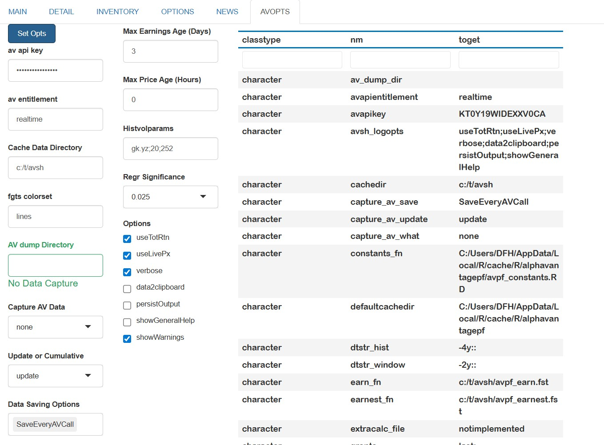
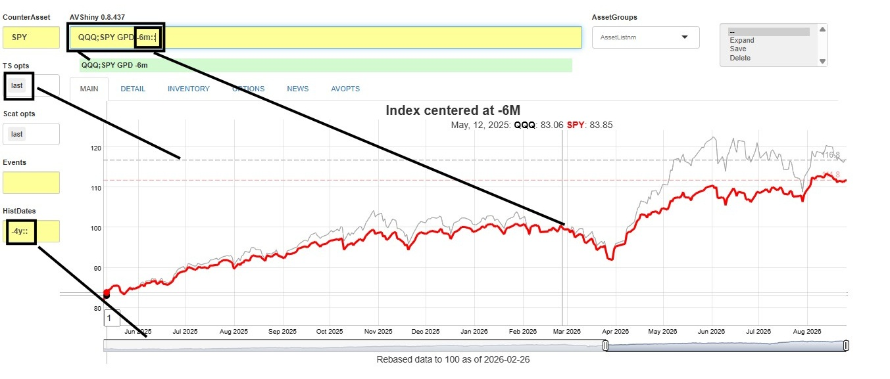
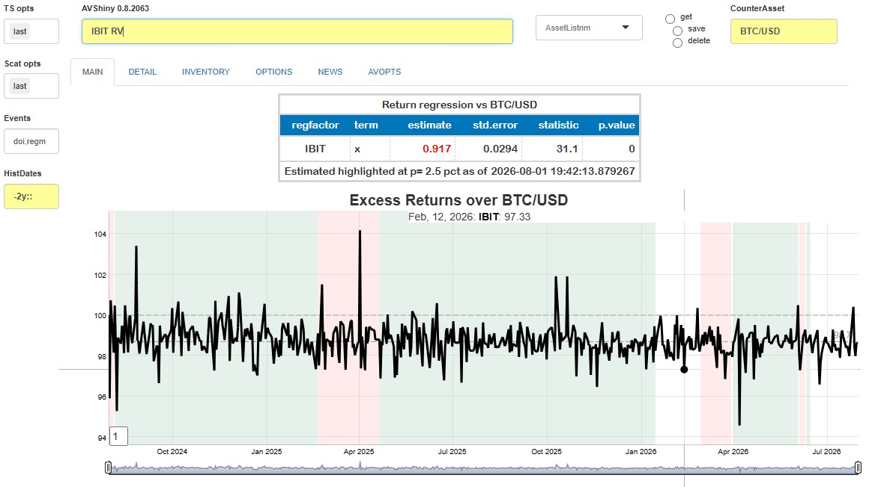
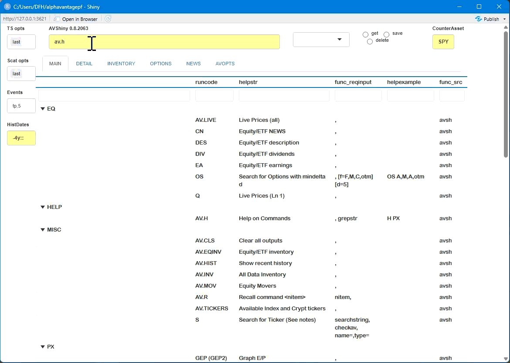
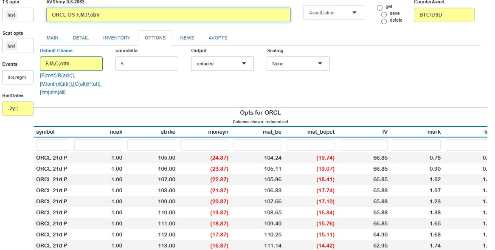

```{r, include = FALSE}
knitr::opts_chunk$set(
  collapse = TRUE,
  comment = "#>"
)
```
The **Alphavantagepf** package contains a Shiny Application which can be used to query, save, and visualize basic market information without having to navigate
the asset-specific functions provided by the Alphavantage API. The app provides an intuitive way to compare small baskets of assets both technically and fundamentally.

This vignette will first go through some overall design goals and conventions before providing an overview of how to start and configure the application.
Once the basic configuration is set, we then show how to get results (and what happens underneath the hood), what can be done, and how to maximize productivity with list
management and function recall features. 

# Overall design goals and conventions

The app is designed to 

* Integrate four main asset classes into an efficient and extendible analyses. 
For example, an equity, an index and FX exchange rate can all be graphed together.
* Minimize the amount of price information downloaded by caching (to the degree possible) older price data.
* Provide interfaces for capturing any data requested and adding external data to the internal cache.
* Provide easy ways to create and retrieve baskets of assets.
* Use modern design elements as much as possible, in particular the [gt](https://gt.rstudio.com/) package and 
the [dygraphs](https://rstudio.github.io/dygraphs/) package. The latter is used via
a "sister" package [FinanceGraphs](https://derekholmes0.github.io/FinanceGraphs/reference/index.html)
* Provide a framework for adding user-generated analyses.

A few conventions which are helpful to know before using the app are[^1]

|Item|Convention|Example|
|:-------:|:-------------------|:-----------|
|Asset Sets|Semicolon `;` delimited tickers|`"IBM;NDX;USD/MXN"`|
|Relative Dates|(Signed) integers followed by `[m|d|y]`, relative to today|`"-4m"`|
|Date Ranges|Relative dates separated by `"::"`|`"-4m::"`, `"-1y::+1y"`|

"Assets" can be any (common) symbol for an Equity, ETF, Currency (in the usual form of an alphabetic string of the form  (`countercurrency` / `currency`),
cryptocurrency[^2], index, or user defined time series.

# App invocation and initial setup.

The app requires a very modest amount of setup before using.  It can be run with 

```{r, eval=FALSE}
require(alphavantagepf)
av_runShiny()
```
When [av_runShiny()](https://derekholmes0.github.io/alphavantagepf/reference/av_runShiny.html) 
is first run, the following screen will be shown, with the <span style="border: 1px solid #000000; padding: 2px 6px;">AVOPTS</span> tab selected.
The first order of business will be to set the Alphavantage API keys and (optionally) set data directories.  To do so, just type or copy in both your API key and 
your entitlement status (`delayed` or `realtime`), and hit the blue <span style="background-color: #003366; color: #FFFFFF;">Set Opts</span> button. 



When the <span style="background-color: #003366; color: #FFFFFF;">Set Opts</span> button is pressed, a table of internal
state variables is shown, with any changes highlighted.  There are several options which can be set, all described in
the [Options Vignette](https://derekholmes0.github.io/alphavantagepf/articles/ShinyApp_2_Graphs_and_Options.html), but one in particular is
worth changing up front.

The app fills in a default data cache location determined by [tools::R_user_dir()].  Since that directory is a cache directory
typically buried in long paths, you may find it helpful to set an alternative location in the `Cache Data Directory` field as has been done
above.  This will provide a consistent and easily accessable portal between the data used by the app and any external analyses or
data collection mechanisms already in place.

After the first invocation, the app will start on the <span style="border: 1px solid #000000; padding: 2px 6px;">INVENTORY</span> tab,
so a user can immediately see what's been updated and search for tickers.

# General Usage

Analyses are all done by invoking "functions" or commands on a set of assets in the yellow line shown above. As described in the README file, 
commands which start with `AV.` are asset-less commands and mostly oriented towards app-specific information such as data inventories or
help pages.  All other commands refer to the semi-colon delimited asset or ticker list given first.

Once you know what you want, just type it in and hit "Enter".  The command will get any data it needs and then 
produce a set of tables, time series graphs, or other plots.  See [Data Vignette](https://derekholmes0.github.io/alphavantagepf/articles/ShinyApp_3_Data_Management.html)
for details as to how this done.  Most commands require a timeframe of historical data to analyze.
The date range (formatted as above) in `HistDates` is used, but other date ranges within that range may be added as parameters.

The app responds as follows:

* Most results will appear in the <span style="border: 1px solid #000000; padding: 1px 5px;">MAIN</span> tab, but some results may appear in function specific
tabs.  For example, the <span style="border: 1px solid #000000; padding: 1px 5px;">OPTIONS</span> tab has specific fields to search for Equity options,
and the  <span style="border: 1px solid #000000; padding: 1px 5px;">NEWS</span> tab has specific fields to narrow search results.  Note that 
there is also a separate <span style="border: 1px solid #000000; padding: 1px 5px;">INVENTORY</span> tab to always have a searchable ticker list available.

* By design, time series graphs are shown first, followed by tables and `ggplot` objects.  THe app allows for two independent time series graphs to be shown
on top of each other.  The second graph is typically made by adding a "2" onto the end of the command.

* Some commands may produce some auxiliary information in a separate tab. That tab is typically called  <span style="border: 1px solid #000000; padding: 1px 5px;">DETAIL</span> 
but can change names to highlight existence of results in the tab.

* Feedback (i.e.an error message) is placed below the command line, but can appear elsewhere.  Progress messages will show in the R Console [^3]

## Examples

You might want to start with `AV.H` which describes all the commands available.  Some examples of commands that can be run are

|Command|Description|
|:-------:|:-------------------|
|`EEM;HEEM GP`|Graph raw time series of the `EEM` ETF and it's hedged counterpart.|
|`QQQ;SPY GPI2`|Graph time series of `QQQ` and `SPY` rebased to 100 at start below the first graph.|
|`QQQ;SPY GPD -6m::`|Graph total return indices of the two ETFs rebased to 100 as of 6 months ago|
|`IBM;ORCL EA`|Table of earnings and estimates for `IBM` and `ORCL`|
|`IBM;ORCL GEP`|Graph Earnings Yield for  `IBM` and `ORCL`|
|`IBM;ORCL CN`|Table of linked News items for `IBM` and `ORCL`|
|`IBM;ORCL DES`|Table of descriptive items for `IBM` and `ORCL`|
|`ORCL OS`|Table of options for `ORCL`|
|`ORCL RV`|Active returns and correlations with the counterasset (default is `SPY`)|
|`AV.EQINV`|Show a list of all ETFs and Equities with downloaded data|

To see how the date conventions work, the results of the third command are shown below.  Note that there is a slider (provided by `dygraphs()`)
which allows you to zoom in or out to specific time windows.  In this case, the graph starts at `-6m::`, where both indices are rebased to 100,
but can be zoomed out to a maximum of 4 years (`HistDates` has `-4y::`) from today.  Finally, the `last` option in `TSopts` puts a horizontal
bar showing the last values of each series.



Here is another example which highlights both the comprehensive abilities to combine assets in the app with graphing abilities. 
Suppose we wish to plot the fair value history of the crypto ETF `IBIT`, and add some visual indication of overall market direction.
Editing the counterasset to `BTC/USD` adding `doi:regm` in Events, and running `IBIT RV` gives the following.

```{r, echo=FALSE, out.width="100%"}

```

# Asset Lists

Securities are seldom analyzed in isolation.  It is easy to create and use ad-hoc groups of securities in this app.

* **To create a list**, First, type in a new name for the list in the `AssetGroups` list box as shown below.  Hit "enter" to add the name
to the set of lists already in existence. (The Enter is necessary for Shiny to know that it's a new identifier.)  
Then either type in the components into the Command line, or use the assets already in the asset line, and hit 
<span style="background-color: #003366; color: #FFFFFF;">save</span> in the box to the right of the `AssetGroups` dropdown.
The assets will then be replaced by the new name, which can be used subsequently in place of the full asset set[^4].

* **To expand a list name on the command line to its components**, simply select the <span style="background-color: #003366; color: #FFFFFF;">Expand</span>
option on the dropdown, and the list name will be replaced by the components.,

The best way to see how this works is with a short clip:

```{r, echo=FALSE, out.width="100%"}

```

You can see a table of current asset lists by running the `AV.INV` command, and can add asset lists outside of the app using
[av_add_assetgroups()](https://derekholmes0.github.io/alphavantagepf/reference/av_add_assetgroups.html).  See 
[Data Vignette](https://derekholmes0.github.io/alphavantagepf/articles/ShinyApp_3_Data_Management.html) for details.

# Specific command notes

## Options Search

To find options for a given set of tickers use the command `OS`, which will take you to the <span style="border: 1px solid #000000; padding: 2px 6px;">OPTIONS</span> tab.
A few fields on that page which will help narrow down the options are:

|Field|Detail|
|:--------------|:-----------------------|
|Chains|Comma delimited string of four items to narrow downloaded options.|
||1. `[F|B]` first contract or second contract|
||2. `[M|Q]` Monthly expiration or Quarterly expiration|
||3. `[C|P|A]` Calls, Puts or Both|
||4. `[itm|otm|all]` In or out of the money[^5]|
|Mindelta|Minimum absolute delta of option|
|Output|Subset of columns to show, relevant to Trading or Valuation|
|Scaling|Values and Greeks for 10 contracts or 10kUSD premium|

The options change can be overridden as parameters to the `OS` call, as seen below.  WIthout the parameters added on the command line, calls would have been
returned.


# Interacting with the app from the command line.

A great and recent innovation in `shiny()` is the ability to run an app and return to the console.  The internal data can be accessed in one of three ways:

* Directly by reading or writing to the files enumerated in [Data Vignette](https://derekholmes0.github.io/alphavantagepf/articles/ShinyApp_3_Data_Management.html)
* One `av_runShiny()` has been run (which loads its data), using functions such as `av_load_shinydata("pxd")`
* Even before `av_runShiny()` has been run, call to `  av_load_shinydata()` and then via functions such as `av_load_shinydata("pxd")`

In addition, internal states and data can be extracted via functions such as [dump_state()](https://derekholmes0.github.io/alphavantagepf/reference/av_state_interface.html). 


[^1]: A "cheatsheet" with these conventions is displayed when `AV.H` is run, unless the `showGeneralHelp` option is deselected.

[^2]: See `AV.TICKERS` for a list of cryptocurrencies available.  Not all are available as symmetric pairs, so please use only those on the list.

[^3]: unless the `verbose` option is deselected in the  <span style="border: 1px solid #000000; padding: 1px 5px;">AVOPTS</span> tab.

[^4]: Adding and using component weights to the asset lists is planned for a future release.

[^5]: The app looks up the current spot to determine moneyness.
