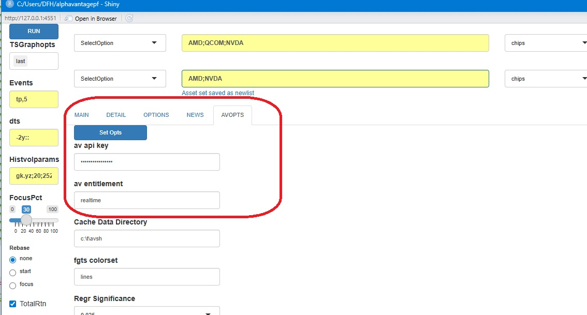
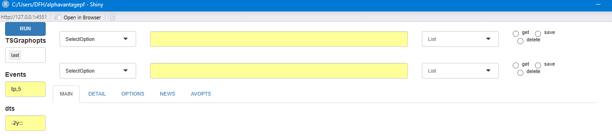
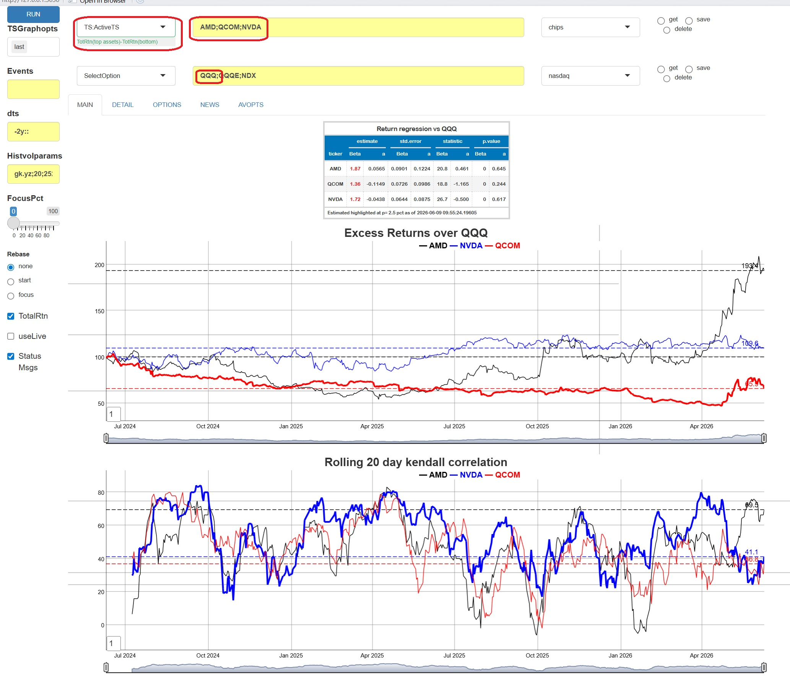
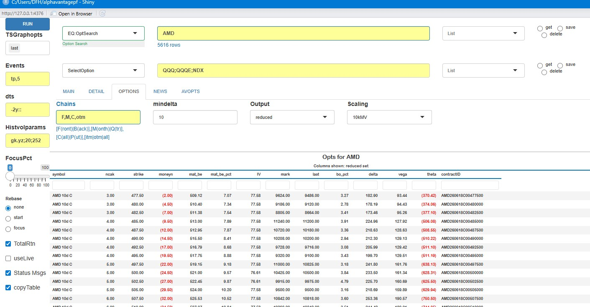

```{r, include = FALSE}
knitr::opts_chunk$set(
  collapse = TRUE,
  comment = "#>"
)
```
The **Alphavantagepf** package also contains a Shiny Application which can be used to query, save, and visualize basic market information without having to navigate
the asset-specific functions provided by the Alphavantage API. The app provides an intuitive way to compare small baskets of assets both technically and fundamentally.

This vignette will first go through some overall design goals and conventions before providing an overview of how to start and configure the application
then give a brief overview of list management and individual analysis components.  Future plans are discussed in an appendix.

# Overall design goals and conventions

The app is designed to 

* Integrate four of the main asset classes into the analysis. For example, an equity, an index and FX exchange rate can all be plotted together.
* Minimize the amount of price information downloaded by caching (to the degree possible) older price data.
* Provide interfaces for capturing any data requested and adding external data to the internal cache.
* Provide easy ways to create and retrieve baskets of assets.
* Use modern design elements as much as possible, in particular the `gt()` package and the `dygraphs()` package. The latter is used via
a "sister" package [FinanceGraphs](https://github.com/derekholmes0/FinanceGraphs).

A few conventions which are helpful to know before using the app are

|Item|Convention|Example|
|:---------:|:------------------------------------|:-------:|
|Asset Sets|Semicolon `;` delimited|`"IBM;NDX;USD/MXN"`|
|Relative Dates|Signed integers followed by `[m|d|y]`, relative to today|`"-4m"`|
|Date Ranges|Relative dates separated by `"::"`|`"-4m::"`, `"-1y::+1y"`|

# App invocation and initial setup.

The app requires a very modest amount of setup before using.  It can be run with 

```{r setup}
library(alphavantagepf)
av_runShiny()
```
When the app is first run, the following screen will be shown, with the `AVOPTS` tab selected.  A screenshot of the first tab is shown below.
The first order of business will be to set the Alphavantage API keys.  To do so, just type or copy in both your API key and 
your entitlement status (Either `delayed` or `realtime`), and hit the blue <span style="color:blue">Set Opts</span> button.

```{r, echo=FALSE, out.width="80%"}

```

Other optional items that can be set are

|Item|Description|
|:---------:|:------------------------------------|
|Cache Data Directory|Directory to store cached price data.  If not specified, a temporary directory will be created and used.|
||Cached data is in a price file (in [fst](https://www.fstpackage.org/) format), and an inventory file|
|fgts colorset|A named aesthetic set for time series line colors, See [fg_update_aes()]|
|Regr Significance|p-values below which regression terms will be highlighted|
|AV dump directory|A directory in which to create a file with each downloaded function call.  See below for details.|
|Capture AV Data|What Alphavantage calls to capture (e.g. Prices, non-prices, or all data)|
|Update or Cumulative|If `Update`, then captured data will be keyed and updated only if new, otherwise all data captured|
||For example, `Update` will only store the latest price for a particular symbol and date|
|Data Saving Options|Control how often the captured data file is cleared or saved|

When capturing is turned on a file called `av_download.RD` will be created and updated in the specified dump directory.
This file will be a named list of data.tables, with a data.table containing all downloaded data corresponding to 
an Alphavantage function (e.g. `TIME_SERIES_DAILY`).  If "cumulative" is selected, all data will time-stamped and added
to the relevant data.table.  If not, then data will be replaced for each relevant key (usually `SYMBOL`).  The user
can then use that file to integrate search histories into other analytics, such as a rolling Markdown file.

# Asset List management

Securities are seldom analyzed in isolation.  It is easy to create and use ad-hoc groups of securities in this app. 

* **To create a list**, First, type in a new name for the list in the list box as shown below, and Hit Enter. Second,
type in the components (separated by semi-colons) and hit the "set" button.

* **To get the assets in a list**, select the desired list from the dropdown and hit "get".

```{r, echo=FALSE, out.width="100%"}

```

You can see a table of current asset lists by running the "Gen:Inventory" command, and can add asset lists outside of the app using
[av_add_assetgroups()]

# Running Basic Analyses

To run analyses, select the desired item from the dropdowns and press the blue <span style="color:blue">RUN</span>.  One of more graphs or tables
will be shown in the "MAIN" tab, with  additional data possible in the "DETAIL" tab.  

Graph events and decorations can be specified in the first two boxes, with annotations for the last level and 5 turning points
used as defaults. The options possible are detailed in the [FinanceGraphs](https://github.com/derekholmes0/FinanceGraphs) [fgts_dygraph()]
documentation. Empty out the boxes for clean graphs. The date ranges plotted come from the "dts" box (see above for conventions), and more
recent data can be focused in on using the <span style="color:blue">FocusPct</span> slider.  For example, if the slider is set to 50pct,
and the date string is `"-2y::"` then the graph will only show the last year of data, but can be slid back to see the entire 2 year period.

Data is plotted in raw form unless the <span style="color:blue">Rebase</blue> options are used. Rebasing at the start will normalize all series
to 100 at the start of the window. (In the the example above, the rebase would occur at the first point plotted 2 years prior to today).
If Rebasing is set to the focus point, the rebasing occurs at that point set by the slider.

The table below shows the current options that can be run. Note that status messages are sent to the console if the "Status Msgs" box
is checked and output data for each analysis is copied to the clipboad if the "copyTable" box is checked.

|Analysis|Explanation/Notes|
|:----------------|:-----------------------|
|Gen:Inventory|Price inventory and Asset Lists|
|Gen:LivePx|Live Price Table|
|Gen:NameSearch|Search for an Equity or Index [1]|
|TS:PriceTS|Time Series of Prices [2],[3]|
|TS:ActiveTS|Time Series of Total Return of Line 1 Assets less Line 2 [4]|
|TS:HistVolTS|Time series of Rolling volatilities and correlations [5]|
|EQ:DES|Table of descriptive data for Line 1 Assets|
|EQ:News|Table of recent news items for Line 1 Assets [6]|
|EQ:DivEarn|Table of Dividends and Earnings for Line 1 Assets|
|EQ:OptSearch|Option Lookup and Search [7] (See Section Below)|
|Gen:Movers|US Market Movers|

Notes

1, Due to Alphavantage limitations, the search returns tickers that begin with the search term.
2. Graphing options are described above. THe graph can interactively be zoomed in on and reset with a double click.  
Two synchronized graphs can be used by selecting this option for both Line 1 and Line 2.
3. Total return data is used unless the box is unchecked. The data is augmented by live data if the box is checked.
4. Graphs show active returns, i.e. Total return of each asset in Line 1 less the first asset (typically a benchmark index) in Line 2. Rolling correlations
and full period betas are also shown.
5. Volatilitity parameters in the  <span style="color:blue">Histvolparams</span> box are passed to the [TTR::volatility()] function.
6. Results will be displayed in the "OPTIONS" tab.
7. Results will be displayed in the "NEWS" tab.

As an example, suppose we wish to look at active returns of three popular chip manufacturers against the Nasdaq 100 broad index.  Put the tickers of interest
in Line 1, and an index in Line 2. (If there are more than one tickers in Line 2, only the first is used.) Select `TS:ActiveTS` and hit run.  The app will
get whatever data it needs, typically from the cache, but augmented with most recent (live) data and produce the following output:

```{r, echo=FALSE, out.width="80%"}

```

# Option Search

To find options for a given set of tickers, Run "EQ:Optsearch" which will take you to the "OPTIONS" tab.
A few fields on that page which will help narrow down the options are:

|Field|Detail|
|:--------------|:-----------------------|
|Chains|Comma delimited string of four items to narrow downloaded options.|
||1. `[F|B]` first contract or second contract|
||2. `[M|Q]` Monthly expiration or Quarterly expiration|
||3. `[C|P|A]` Calls, Puts or Both|
||4. `[itm|otm|all]` In or out of the money|
|Mindelta|Minimum absolute delta of option|
|Output|Subset of columns to show, relevant to Trading or Valuation|
|Scaling|Values and Greeks for 10 contracts or 10kUSD premium|

The app looks up the current spot to determine moneyness.  A skew graph is plotted after the table.

```{r, echo=FALSE, out.width="80%"}

```

# Managing data outside of the app.

All of the downloaded price history, as well as an inventory of prices are stored either in a temporary directory created when the app is first run,
or a directory specified in the "AVOPTS" tab.  The price data is stored in [fst](https://www.fstpackage.org/) format, which has been the performance winner for
several years.  The data stored augments that returned by (e.g.) `av_get_pf("IBM","TIME_SERIES_DAILY")` function wih split and dividend data returned by
other [av_get_pf()] calls.  The full set is shown below

`
  symbol  timestamp  open  high   low close adjusted_close volume dividend_amount split_coefficient                  ts origclose
  <char>     <IDat> <num> <num> <num> <num>          <num>  <num>           <num>             <num>              <POSc>     <num>
   ABBNY 2001-04-06  7.37  7.37  7.27  7.29           7.29 162100               0             0.433 2026-05-31 08:06:48      16.8
   ABBNY 2001-04-09  7.32  7.50  7.32  7.50           7.50  31300               0             0.433 2026-05-31 08:06:48      17.3
`

Note that a timestamp for each data retrieval is also kept. Of course, that data can be accessed by any other R script or document.  The data can also be added to externally 
using the [av_add_data()] function.  Any time series can be added, but not all time series can be guaranteed to be updated by Alphavantage calls. The app tries to update any data as 
best as it can.

## Integrating different asset classes.

One difficulty with Alphavantages' API platform is that there are different function calls (and returned data sets) for each major asset class.  This app integrates them 
into one price table, but at the expense of *having to know each asset type* for the data added.  The app will call `av_get_pf(."SYMBOL_SEACH")` to determine if an ETF or Equity,
or will infer the type from the ticker and lists of supported indices and Crypto pairs.

Data which is completely exogenous to Alphavnatage can also be added to the app's cached data set. 


